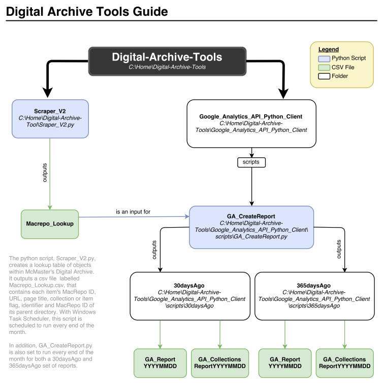

# Digital Archive Tools

**This repository is a resource to perform web analytics on the McMaster University Library's Digital Archive of Map Collections, collecting and reporting web data through the use of Google Analytics. Access a sample of an annual Google Analytics Report [here.](https://github.com/maclibGIS/Digital-Archive-Tools/tree/master/Google_Analytics_API_Python_Client/scripts/365daysAgo)**

## Table of Contents

**[Tool: Scraper_V2.py](https://github.com/maclibGIS/Digital-Archive-Tools#tool-scraper_v2py)**  
**[Resource: Macrepo_Lookup.csv](https://github.com/maclibGIS/Digital-Archive-Tools#resource-macrepo_lookupcsv)**  
**[Folder: Google Analytics API Python Client](https://github.com/maclibGIS/Digital-Archive-Tools#folder-google-analytics-api-python-client)**

   **[Tool: GA_Filter.py](https://github.com/maclibGIS/Digital-Archive-Tools#tool-ga_filterpy)**  
   **[Tool: GA_CreateReport.py](https://github.com/maclibGIS/Digital-Archive-Tools#tool-ga_createreportpy)**  
   **[Resource: Google Analytics Reports](https://github.com/maclibGIS/Digital-Archive-Tools#resource-google-analytics-reports)**  
   **[A Guide to Creating a Web Analytics Annual Report](https://github.com/maclibGIS/Digital-Archive-Tools#a-guide-to-creating-a-web-analytics-annual-report)**   
   **[Resource: Exploring Google Analytics.txt](https://github.com/maclibGIS/Digital-Archive-Tools#resource-exploring-google-analyticstxt)**  
   **[A Guide to The Project's Initial Creation](https://github.com/maclibGIS/Digital-Archive-Tools#a-guide-to-the-projects-initial-creation)**

## Tool: Scraper_V2.py

Using Python 3.4, basic web page information is collected for MacRepo IDs identified as belonging to the Library's Map Collections and stored in an output CSV file. This script is an updated version of Scraper.py found in the OldTools folder, which in addition to each object's MacRepo ID, URL, page title, and sub-collection or item flag, also outputs the identifier and MacRepo ID of the parent directory of each object in the Library's Map Collections. Every month, Windows Task Scheduler runs Scraper_V2.py through an associated batch file, creating an updated list of Map Collection items as of the date it is run, labelled Macrepo_LookupYYYYMMDD. In addition, Scraper_V2.py overwrites an existing and temporary Macrepo_Lookup.csv file. This is the file used within the Google Analytics API Python Client as the list of MacRepo IDs that web analytics is later performed on.

## Resource: Macrepo_Lookup.csv

This CSV file is the output file containing MacRepo ID information for sub-collections or items belonging to the Library's Map Collections. This information includes each object's MacRepo ID, URL, page title, sub-collection or item flag, identifier, and MacRepo ID of the parent directory of each object in the Library's Map Collections. This file is updated monthly on the 1st of every month with Windows Task Scheduler. It is then used at the end of the month as the list of MacRepo IDs Google Analytics performs on.

### Macrepo_Lookup Columns:
1. Item Macrepo Number
2. Item URL
3. Item Title
4. Item Type Flag: folder=2, item==1
5. Identifier (items only)
6. Macrepo Number of Direct Parent Collection 
7. Macrepo Number of Top-Level Collection
8. (Through Column 15) - All Parent Folders 

## Folder: Google Analytics API Python Client

**_Navigate to this folder [here](https://github.com/maclibGIS/Digital-Archive-Tools/tree/master/Google_Analytics_API_Python_Client/scripts) or at Google_Analytics_API_Python_Client --> scripts_**

### Tool: GA_Filter.py

Using Python 2.7.8, this script performs a Google Analytics query to obtain the page title, number of users, and number of page views for each MacRepo ID within the Library's Maps Collections. This data is stored in a temporary output file in CSV, labelled GA_Data.csv.

### Tool: GA_CreateReport.py

Using Python 2.7.8, Google Analytics data in GA_Data.csv is parsed and formatted into a readable CSV format. Additional information for each web page is also appended, including a sub-collection or item flag, identifier, and parent directory for each MacRepo ID of the Library's Maps Collections. Two output Google Analytics Report files are created; one for  all sub-collections and items within the Library's Map Collections labelled GA_ReportYYYYMMDD and one for the top-level sub-collections within the Library's Map Collections labelled GA_CollectionsReportYYYYMMDD, with YYYYMMDD as the report creation date. With batch files then created for 7daysAgo, 30daysAgo, and 365daysAgo web data time spans, Windows Task Scheduler was set up to run a 30daysAgo and 365daysAgo report at the end of every month. Note that each of these scripts take a minimum of 24 hours or more to run. For this reason, each script is scheduled at least two days apart from the other.

### Resource: Google Analytics Reports

The reports are organized by the durations for which web data is captured. For our purposes, weekly, monthly, and yearly reports are created. Each report contains the MacRepo ID, number of users, number of page views, sub-collection or item flag, identifier, and parent directory for each MacRepo ID of the Library's Maps Collections. These reports may be found in the following folders: 

**[7daysAgo](https://github.com/maclibGIS/Digital-Archive-Tools/tree/master/Google_Analytics_API_Python_Client/scripts/7daysAgo) [30daysAgo](https://github.com/maclibGIS/Digital-Archive-Tools/tree/master/Google_Analytics_API_Python_Client/scripts/30daysAgo) [365daysAgo](https://github.com/maclibGIS/Digital-Archive-Tools/tree/master/Google_Analytics_API_Python_Client/scripts/365daysAgo)**

### *A Guide to Creating a Web Analytics Annual Report*

Annual web analytics reports for the Digital Archive are available for 2016/2017 and 2017/2018 periods. The following instructions are a guide on how to update these reports based on new data for a reporting period. In order to obtain data from Google Analytics, access to [The Google Analytics Console](https://analytics.google.com/analytics/web) with the appropriate API key is required.

	1. The annual report is created with multiple data resources:
	
	- 365daysAgo GA_ReportYYYYMMDD.csv
	- 365dayAgo GA_CollectionsReportYYYYMMDD.csv
	- 365daysAgo GA_TopLevelCollectionsReportYYYYMMDD.csv
	- The Google Analytics Console

	2. Update the summary page by collecting item statistics on:

	- The total number of items using GA_ReportYYYYMMDD.csv
	- The total number of item pageviews using GA_TopLevelCollectionsReportYYYYMMDD.csv
	- The total number of pageviews for the Map Collection's main page using The Google Analytics Console
	
	- The number of pageviews for items within each individual Top-Level Collection using GA_TopLevelCollectionsReportYYYYMMDD.csv
	- The number of pageviews for the ten most viewed items using using GA_ReportYYYYMMDD.csv

	3. The user overview and in-depth analysis sections of the report analyze user data for the top ten collections and top ten items for the year. 
	While the top ten items were obtained earlier with GA_ReportYYYYMMDD.csv, the top ten collections are obtained with GA_CollectionsReportYYYYMMDD.csv.
	
	4. The Google Analytics Console is used to obtain user data for the top ten collections and top ten items. 
	Specifically, the geographic location of users and referring sites to Map Collection items are analyzed. 
	For the purposes of reporting the most significant data (ie. countries and referring sites sourcing a high volume of Map Collection users), it is recommended to begin creating the in-depth analysis section of the report before the user overview. 
	Begin by navigating to Reports --> Behaviour --> Site Content --> All Pages within the analytics console. 

	5. Create the in-depth analysis:
	
	Obtain information on a specific collection or item page by entering the MacRepo ID of the web page in the search bar.

	- Determine the number of unique users and pageviews broken down by user countries:
	Set Primary Dimension to Page --> Set Secondary Dimension to Users --> Country.
	Record the data for the top five countries based on total pageviews.
	
	- Determine the number of unique users and pageviews broken down by users' referring sites:
	Set Primary Dimension to Page --> Set Secondary Dimension to Behavior --> Full Referrer
	Record the data for the top eight referring sites based on total pageviews.
	
	For more details, refer to Exploring Google Analytics.txt found in this folder.
	
	6. Create the user overview:
	
	Based on judgment for the top countries and referring sites common to the top ten collections, select a number of countries and referring sites (8 to 10) to record the percentage of pageviews in the respective tables. 
	Perform the same procedure for the top ten items. 
	
	7. Once all data is obtained, assemble the Map Collection User Summary found at the beginning of the report. 
	Along with a brief description of the year's findings, create pie charts for the top six countries and top six referring sites for the map collection's main page. 
	(I created my pie charts in Google Sheets!)
	
	After fine-tuning and review, the Web Analytics Report is ready to be showcased!
	
### Resource: Exploring Google Analytics.txt

This text file contains key documentation in navigating the Google Analytics dashboard for McMaster University Library users.

### *A Guide to The Project's Initial Creation*

The following instructions are a guide on how to first set-up Python and the Google Analytics reporting API, then edit the Python scripts within this folder to create a CSV report on the reported data.

	1. The link below is a guide on setting up the Google Analytics API for the first time.
	
	Follow steps 1-4 within the link below to:
	- Download and install Python 2.7 on your computer.
	- Install the Google API Python Client to your computer.
		- If the pip module is not installed, download get-pip.py here: https://bootstrap.pypa.io/get-pip.py. 
		- Install the pip module by running the downloaded get-pip.py script.
	- Create a new Google Analytics API Project.
	
	http://www.ryanpraski.com/google-analytics-reporting-api-python-tutorial/
	
	2. Download the Google Analytics API Python Client folder.
	Follow the link to the full code repository on GitHub. Download the 'Google_Analytics_API_Python_Client' folder to your C:\ drive.
	
	https://github.com/maclibGIS/Digital-Archive-Tools/tree/master/Google_Analytics_API_Python_Client
	
	3. Add Your Google Analytics API Client Secret Credentials.
	In the Google_Analytics_API_Python_Client folder, open the scripts folder.
	
	\Google_Analytics_API_Python_Client\scripts
	
	Open the client_secrets.json file in a text editor such as NotePad++. 
	Delete all the text in this client_secret.json file. 
	Find the client_secret.json file that you created and downloaded from the Google Developer console. 
	Open your client_secret.json file in NotePad++ and copy the text in your file (this has your API credentials) and paste the text into the sample client_secrets.json file that was in the scripts folder.
	Make sure to save the file.

	4. Obtain your View ID (also called Profile ID) from the Google Analytics Core Reporting API Query Explorer.
	
	Follow this link to the Google Analytics Core Reporting Query Explorer.
	https://ga-dev-tools.appspot.com/query-explorer/
	
	Choose the Account, Property and View you’d like to get data from. 
	When you select a view the 'ids' field will be populated with the unique Google Analytics View (Profile) ID. 
	You can also find your View (profile) ID in the ADMIN section of Google Analytics' web interface (https://www.google.com/analytics/web/) under View Settings in your specific view.
	
	5. Google Analytics API Python Query Data Output to Excel.
	
	Open GA_Filter.py and choose edit with IDLE. Edit the script at the 4 prompts to change file path names,file names, and the View or Profile ID you obtained from the previous step.
	Open GA_CreateReport.py and choose edit with IDLE. Edit the script at the 3 prompts to change file path names and file names.
	
	Note: Each report file name is of the form 'GA_ReportYYYYMMDD.csv' with the date on which the query was performed.
	

The steps below are a guide on how to set up GA_CreateReport to run within Windows Task Scheduler.
	
	6. The Google_Analytics_API_Python_Client folder should be located within your local C:\ drive. 
	If it is not, copy it into any folder within the C:\ drive. 
	Make sure that all file paths within GA_Filter and GA_CreateReport refer to the correct directory.
	
	7. Edit the batch file labelled "GA_CreateReport_30daysAgo" with Notepad ++. 
	Change the directory in the second line to the directory in which the batch file is contained.
	
	8. Follow the link below to instructions on creating a scheduled task within Windows Task Scheduler. 
	Choose the .bat file  "GA_CreateReport_30daysAgo" as the program/script to run. 
	You may edit this file if you wish to change the start date of your Google Analytics Query, or you may use the existing 3 batch files already created within the "...\Google_Analytics_API_Python_Client\scripts" folder.
	
	http://www.thewindowsclub.com/how-to-schedule-batch-file-run-automatically-windows-7
	
	Note: When selecting security options, choose 'Run whether user is logged on or not.
	Note: Since each report creation script takes at least 24 hours to run, ensure that a minimum of two days is allocated between scheduled scripts.
	Note: In the case that the user account chosen to run the task does not have administrative privileges, follow this link to give that user 'Log on as Batch Job' Rights.
	https://www.smartftp.com/support/kb/how-to-give-a-user-log-on-as-a-batch-job-rights-f2691.html
	
	
	
	
	
	
	
	
	
	